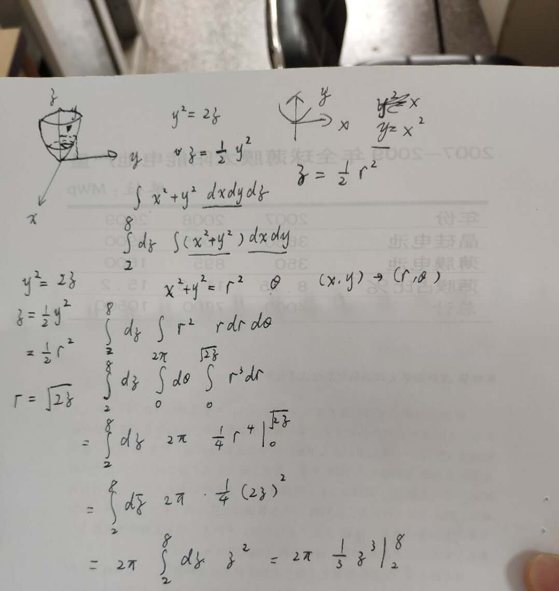

# puzzles

## 操作内容

A1,a2,a3,a4:

```python
import numpy as np

from numpy.linalg import lstsq


a=np.mat([[13627,26183,35897,48119],[23027,38459,40351,19961],[36013,45589,17029,27823],[43189,12269,21587,33721]])

b=np.mat([347561292,361760202,397301762,350830412]).T

x=lstsq(a,b)

print (x)
```

x的解就是这4个值

Part1:

这三个数都是质数，算出第一个数到第四个数的所有质数，猜测第一个数到第二个数，第二个数到第三个数以及第三个数到第四个数之间的质数个数都是一样的。发现果然是这样的，就得到了part1.

Part2：

进行积分得到7700

Part3：

E = B * 2 * pi * r * dr/dt = part3 * pi/233

将数据代入得到part3

Part4：



解得1008*pi/3 = part4*pi/120

最后拼接得flag

